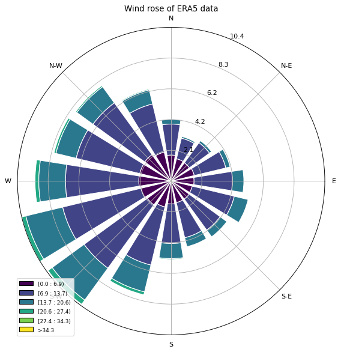

## Yield Predictions for German Offshore Tenders 2024 Project Overview
### Python Programming in Energy Science II - Group 5
---
- [PDF Instructions](./data/PPES-SoSe2024_StudentProject.pdf)
- [Github Repository](https://github.com/boujuan/StudentProject-Yield-Predictions-Offshore)

**AUTHORS:**
- [Jiah Ryu](mailto:jiah.ryu@uni-oldenburg.de)
- [Julia Guimaraes Zimmer](mailto:julia.guimaraes.zimmer@uni-oldenburg.de)
- [Pascal Pflüger](mailto:pascal.pflueger@uni-oldenburg.de)
- [Juan Manuel Boullosa Novo](mailto:juan.manuel.boullosa.novo@uni-oldenburg.de)

**DATA:**
- Floating Lidar Measurements from two positions = `'data/measurements/*.nc'`
- Long-term reference model data (ERA5): 1990-2023 = `'data/reanalysis/*.csv'`
- Turbine coordinates of existing wind farms = `'data/turbine-info/coordinates/existing/*.csv'`
- Turbine coordinates of planned wind farms = `'data/turbine-info/coordinates/planned_future/*.csv'`
- Turbine coordinates in operation before 2023 = `'data/turbine-info/coordinates/planned_in_operation_before_2030/*.csv'`
- Turbine coordinates planned in Netherlands = `'data/turbine-info/coordinates/planned_netherlands/*.csv'`
- Geometric turbine coordinates for the areas of interest N-9.1/N-9.2/N-9.3 (not optimized – see Task 12) = `'data/turbine-info/coordinates/area_of_interest/*.csv'`
- Shapefiles of wind farm areas, the countries Denmark, Germany and the Netherlands = `'data/shapefiles/.../*'`
- Thrust and power curves of wind turbines = `'data/turbine-info/power_curves/*.csv'`

---

**TASKS:**
To estimate the short-term wind climate of the three areas of interest, we first look at the planned area. Furthermore, we explore the structure given in the NC files and choose the data we need for further analytics:

1. Import libraries, set up file paths, and open datasets
2. Set turbine design:
   - Hub height
   - Rotor diameter
   - Model, etc.
3. Plot the field of interest together with the lidar measurement buoy positions
4. Explore the structure and variables inside the NC files
5. Decide which data to use for further analytics
6. Select variables of interest
7. Create a dataframe out of them
8. Check for data gaps, NaN values, and duplicated data
9. Filter incorrect data points
10. Select data for only one year, so that buoy 2 and buoy 6 have the same length
11. Interpolate both buoy datasets, with the 140 m and 200 m to hub height of 150 m
12. Create a new dataframe for the interpolated data
13. Export it to a CSV file for further use
14. Compare Buoy 2 and 6 to ensure that the data processing didn’t go wrong
15. Plot time series of the wind speed for both met masts
16. Calculate the monthly and annual wind statistics for the windspeed and the wind direction for both met masts 
17. Calculate the monthly and annual wind statistics for the wind speed and the wind direction for both buoys
18. Plot the monthly mean wind speed and wind direction for both buoys
19. Plot the diurnal wind speed and wind direction for both buoys
20. Plot wind roses for both buoys 
21. Plot a Weibull distribution of the windspeed 
22. Calculate the annual Power Production of one Turbine, one field and the entire farm 
23. Plot a power curve
24. Explore ERA5 Data
25. Comparison of measurement data with ERA5 data
26. **[TASK 3]** Long-term correction of the measurement data - MCP using Linear Regression
27. Long Term Wind Climate - Data Loading
28. Calculate the monthly and annual wind statistics for the wind speed and the wind direction for both buoys
29. Plot the monthly mean wind speed and wind direction for B6
30. Group the data into hours of the day and calculate the mean wind speed and wind direction for each hour of the day
31. Plot the diurnal wind speed and wind direction for both buoys
32. Plot wind roses for both buoys
33. Plot a Weibull distribution of the wind speed
34. Calculate the annual power production of one turbine, one field, and the entire farm
35. Plot a power curve
36. **[TASK 5]** Generation a geometric layout
37. Plot all optimized Areas in one figure
38. **[TASK 6]** Calculate the yield of the areas N-9.1, N-9.2, N-9.3 without external effects. Use the long-term corrected ERA5 data as input. 
39. Compute Power for gem. Layout without external wake effects 
40. **[TASK 7]** Use 3 other wake models to calculate the farm yield
41. **[TASK 8]** Calculate Farm Yield with internal and external wake effects 
42. **[TASK 9]** How much percentage and TWh do we lose due:
43. **[TASK 10]** Calculate the yield of the single areas N-9.1, N-9.2, N-9.3 without external effects.
44. Compute Power for N9-1 - 3 separately

The correlation should be really good, since buoy 2 consists of data corrected with data from buoy 6. So this is also a test if the steps before are done well. If the correlation is not high (r^2 ~ 0.9), then this is a sign that something went wrong in the steps before. 

**REMARK:** From the 01_Data_and_Windfield_Overview.ipynb we decided to work with: buoy_6_measured and buoy_2_correlated_with_6 because buoy 2 had a lot of data gaps (not a complete year measured).

---

#### Booleans to decide what to plot/compute:


```python
do_all = 1 # set TRUE to calculate and plot every function

booleans = {
    'check_environment': 0,
    'plot_wind_farm_data': 0,
    'plot_wind_farm_data_zoomed': 0,
    'netcdf_explore': 0,
    'plot_buoy_data': 1,
    'data_analysis': 1,
    'interpolate': 1,
    'plot_regression': 1,
    'plot_interpolation': 1,
    'short_term_analysis': 1,
    'plot_short_term': 1,
    'plot_windrose': 1,
    'calculate_AEP': 1,
    'plot_weibull': 1,
    'plot_power_curve': 1,
    'era5_analyze': 1,
    'longterm_correct': 1,
    'longterm_analysis': 1,
    'longterm_AEP': 1,
    'geo_foxes_layout': 1,
    'foxes_analyze': 1,
    'no_ext_wake_layout_power_foxes_1': 0,
    'no_ext_wake_layout_power_foxes_2': 0,
    'no_ext_wake_layout_power_foxes_3': 0,
    'ext_wake_farm_yield': 1,
    'separate_foxes_layouts': 1,
    'combined_cluster': 1
}

globals().update({b: 1 if do_all else v for b, v in booleans.items()})
```

#### Libraries Import:


```python
if check_environment:
    from checkenv_requirements import check_and_install_packages
    packages_to_check = ['numpy', 'pandas', 'netCDF4', 'matplotlib', 'cartopy']
```


```python

# Custom libraries
import data_loading
import plotting
import netcdf_exploration
import data_analysis
import interpolation
import era5_analysis
import longterm
import geo_layout
import foxes_analysis

import glob
import pandas as pd
import geopandas as gpd
import numpy as np
import os
```

    2024-06-23 21:50:47,410 - WARNING - Cannot find header.dxf (GDAL_DATA is not defined)
    

#### File Paths:


```python
# Base paths
measurements_path = 'data/measurements/'
turbine_info_path = 'data/turbine-info/coordinates/'
turbine_power_curves_path = 'data/turbine-info/power_curves/'
shapefiles_path = 'data/shapefiles/'
era5_path = 'data/reanalysis/'

# Buoy NetCDF files
bouy6_path = f'{measurements_path}2023-11-06_Buoy6_BSH_N-9.nc'
bouy2_path = f'{measurements_path}2023-11-09_Buoy2_BSH_N-9.nc'
# Windfarm layout base paths
turbines_existing_path = f'{turbine_info_path}existing/'
turbines_planned_future_path = f'{turbine_info_path}planned_future/'
turbines_planned_in_operation_before_2030_path = f'{turbine_info_path}planned_in_operation_before_2030/'
turbines_planned_netherlands_path = f'{turbine_info_path}planned_netherlands/'
turbines_area_of_interest_path = f'{turbine_info_path}area_of_interest/'
# Countries Shapefiles paths
shapefiles_DEU_path = f'{shapefiles_path}DEU/DEU_adm1.shp'
shapefiles_DNK_path = f'{shapefiles_path}DNK/gadm36_DNK_1.shp'
shapefiles_NLD_path = f'{shapefiles_path}NLD/gadm36_NLD_1.shp'

# Wind field layout files
file_N9_1 = f'{turbines_area_of_interest_path}layout-N-9.1.geom.csv'
file_N9_2 = f'{turbines_area_of_interest_path}layout-N-9.2.geom.csv'
file_N9_3 = f'{turbines_area_of_interest_path}layout-N-9.3.geom.csv'

# Existing turbines
existing_files = glob.glob(f'{turbines_existing_path}*.csv')
# Planned future turbines
planned_future_files = glob.glob(f'{turbines_planned_future_path}*.csv')
# Turbines planned to be in operation before 2030
planned_before_2030_files = glob.glob(f'{turbines_planned_in_operation_before_2030_path}*.csv')
# Planned turbines in the Netherlands
planned_netherlands_files = glob.glob(f'{turbines_planned_netherlands_path}*.csv')

turbine_power_curve_path = f'{turbine_power_curves_path}IEA-15MW-D240-H150.csv'
site_shp = gpd.read_file(f'{shapefiles_path}FEP2024_PreDraft/site.shp') 

```

    2024-06-23 21:50:48,666 - WARNING - Cannot find header.dxf (GDAL_DATA is not defined)
    2024-06-23 21:50:48,669 - WARNING - Cannot find header.dxf (GDAL_DATA is not defined)
    

#### 1. Data Loading:


```python
# Load NetCDF buoy datasets
xrbuoy6, xrbuoy2, buoy2_file, buoy6_file = data_loading.datasets(bouy6_path, bouy2_path)

# Load Wind field layout CSV data
data_N9_1, data_N9_2, data_N9_3 = data_loading.csv_files(file_N9_1, file_N9_2, file_N9_3)

# Load other windfarm data
existing_data = data_loading.other_windfarm_data(existing_files)
planned_future_data = data_loading.other_windfarm_data(planned_future_files)
planned_before_2030_data = data_loading.other_windfarm_data(planned_before_2030_files)
planned_netherlands_data = data_loading.other_windfarm_data(planned_netherlands_files)

other_wind_farm_data = existing_data + planned_future_data + planned_before_2030_data + planned_netherlands_data
```

#### 2. Set the Turbine Design: 
- International Energy Agency (IEA) for a 15 MW offshore wind turbine
- Turbine name: IEA-15MW-D240-H150
-rotor diameter:  240 meters
- hub height: 150 meters

With that we say the height of interest is the one, nearest on the hub height: 140 m 


#### 3. Plot the field of interest together with the lidar measurement buoy positions:


```python
if plot_wind_farm_data:
    plotting.plot_wind_farms_and_buoys(shapefiles_path, data_N9_1, data_N9_2, data_N9_3, other_wind_farm_data)
```

    2024-06-23 21:50:48,893 - WARNING - Cannot find header.dxf (GDAL_DATA is not defined)
    2024-06-23 21:50:48,896 - WARNING - Cannot find header.dxf (GDAL_DATA is not defined)
    2024-06-23 21:50:49,030 - WARNING - Cannot find header.dxf (GDAL_DATA is not defined)
    2024-06-23 21:50:49,034 - WARNING - Cannot find header.dxf (GDAL_DATA is not defined)
    2024-06-23 21:50:49,213 - WARNING - Cannot find header.dxf (GDAL_DATA is not defined)
    2024-06-23 21:50:49,216 - WARNING - Cannot find header.dxf (GDAL_DATA is not defined)
    


    

    


```python
if plot_wind_farm_data_zoomed:
    plotting.plot_wind_farms_and_buoys_zoomed(data_N9_1, data_N9_2, data_N9_3)
```


    

    


#### 4. Explore the structure and variables inside the  2 netcdf files:


```python
if netcdf_explore:
    netcdf_exploration.overview(buoy2_file)
```

    TopGroup Nr. 1: ZX_LIDAR_WLBZ_2
    TopGroup Nr. 2: METEO_WLBZ_2
    TopGroup Nr. 3: ADD_DATA_WLBZ_2
    TopGroup Nr. 4: ZX_LIDAR_WLBZ_6_MCP
    TopGroup Nr. 5: METEO_WLBZ_6_MCP
    ---------------------------------------------------------
    TopGroup: ZX_LIDAR_WLBZ_2
        Groupvariable: wind_speed
        Groupvariable: wind_from_direction
        Groupvariable: wind_from_direction_availability
        Groupvariable: wind_speed_availability
        Groupvariable: wind_speed_min
        Groupvariable: wind_speed_max
        Groupvariable: wind_speed_stddev
        Groupvariable: wind_count
        Groupvariable: turbulence_intensity
        Groupvariable: algorithm_bitmask
    TopGroup: METEO_WLBZ_2
            Subgroup: Vaisala Weather Station
                SubGroupVariable: rain_accumulation
                SubGroupVariable: rain_accumulation_calculated
                SubGroupVariable: rain_duration
                SubGroupVariable: rain_intensity
                SubGroupVariable: hail_accumulation
                SubGroupVariable: hail_duration
                SubGroupVariable: hail_intensity
                SubGroupVariable: precipitation_count
                SubGroupVariable: air_temperature
                SubGroupVariable: relative_humidity
                SubGroupVariable: air_pressure
                SubGroupVariable: air_density
                SubGroupVariable: air_density_moist
                SubGroupVariable: PTH_count
                SubGroupVariable: wind_speed_average
                SubGroupVariable: wind_speed_min
                SubGroupVariable: wind_speed_max
                SubGroupVariable: wind_count
            Subgroup: Airmar Weather Station
                SubGroupVariable: air_pressure
                SubGroupVariable: air_temperature
                SubGroupVariable: air_density
                SubGroupVariable: wind_speed_min
                SubGroupVariable: wind_speed_max
                SubGroupVariable: wind_speed_average
                SubGroupVariable: wind_from_direction
                SubGroupVariable: count
    TopGroup: ADD_DATA_WLBZ_2
            Subgroup: CTD
                SubGroupVariable: sea_water_pressure
                SubGroupVariable: sea_water_temperature
                SubGroupVariable: sea_water_electrical_conductivity
                SubGroupVariable: sea_water_salinity
                SubGroupVariable: speed_of_sound_in_sea_water
                SubGroupVariable: sea_water_sigma_t
                SubGroupVariable: count
            Subgroup: DEFI
                SubGroupVariable: sea_water_temperature
            Subgroup: Coda Octopus
                SubGroupVariable: sea_surface_wave_significant_height
                SubGroupVariable: sea_surface_wave_period_at_variance_spectral_density_maximum
    TopGroup: ZX_LIDAR_WLBZ_6_MCP
        Groupvariable: wind_from_direction
        Groupvariable: wind_speed
    TopGroup: METEO_WLBZ_6_MCP
            Subgroup: Airmar Weather Station
                SubGroupVariable: air_pressure
                SubGroupVariable: air_temperature
            Subgroup: Vaisala Weather Station
                SubGroupVariable: air_pressure
                SubGroupVariable: air_temperature
                SubGroupVariable: relative_humidity
    ---------------------------------------------------------
    


```python
if netcdf_explore:
    netcdf_exploration.topgroup_variables(buoy2_file,'ZX_LIDAR_WLBZ_2')
```

    Variable Name: wind_speed
    Variable Attributes:
        Units: m/s
        Long Name: Wind speed
        Shape: (67680, 1, 1, 6)
    ---------------------------------------------------------
    Variable Name: wind_from_direction
    Variable Attributes:
        Units: degree
        Long Name: Horizontal wind direction
        Shape: (67680, 1, 1, 6)
    ---------------------------------------------------------
    Variable Name: wind_from_direction_availability
    Variable Attributes:
        Units: percent
        Long Name: Availability of the horizontal wind direction
        Shape: (67680, 1, 1, 6)
    ---------------------------------------------------------
    Variable Name: wind_speed_availability
    Variable Attributes:
        Units: percent
        Long Name: Availability of the horizontal wind speed
        Shape: (67680, 1, 1, 6)
    ---------------------------------------------------------
    Variable Name: wind_speed_min
    Variable Attributes:
        Units: m/s
        Long Name: Minimum wind speed
        Shape: (67680, 1, 1, 6)
    ---------------------------------------------------------
    Variable Name: wind_speed_max
    Variable Attributes:
        Units: m/s
        Long Name: Maximum wind speed
        Shape: (67680, 1, 1, 6)
    ---------------------------------------------------------
    Variable Name: wind_speed_stddev
    Variable Attributes:
        Units: m/s
        Long Name: Standard deviation of the wind speed
        Shape: (67680, 1, 1, 6)
    ---------------------------------------------------------
    Variable Name: wind_count
    Variable Attributes:
        Units: -
        Long Name: Count of high-resolution wind data points
        Shape: (67680, 1, 1, 6)
    ---------------------------------------------------------
    Variable Name: turbulence_intensity
    Variable Attributes:
        Units: %
        Long Name: Adjusted turbulence intensity
        Shape: (67680, 1, 1, 6)
    ---------------------------------------------------------
    Variable Name: algorithm_bitmask
    Variable Attributes:
        Units: -
        Long Name: Algorithm bitmask of wind data points
        Shape: (67680, 1, 1, 6)
    ---------------------------------------------------------
    


```python
if netcdf_explore:
    netcdf_exploration.topgroup_variables(buoy2_file, 'ZX_LIDAR_WLBZ_6_MCP')
```

    Variable Name: wind_from_direction
    Variable Attributes:
        Units: degree
        Long Name: Measure correlate predict corrected wind direction data from dataset ZX_LIDAR_WLBZ_6 measured by WLBZ_6.
        Shape: (67680, 1, 1, 6)
    ---------------------------------------------------------
    Variable Name: wind_speed
    Variable Attributes:
        Units: m/s
        Long Name: Measure correlate predict corrected wind speed data from dataset ZX_LIDAR_WLBZ_6 measured by WLBZ_6).
        Shape: (67680, 1, 1, 6)
    ---------------------------------------------------------
    


```python
if netcdf_explore:
    netcdf_exploration.sub_groups(buoy2_file, 'METEO_WLBZ_2')
```

    SUBGROUP: Vaisala Weather Station
    Variable Name: rain_accumulation
    Variable Attributes:
        Units: mm
        Long Name: Rain accumulation measured by the Vaisala Weather Station at 3 m above MSL
        Shape: (67680, 1, 1)
    ---------------------------------------------------------
    Variable Name: rain_accumulation_calculated
    Variable Attributes:
        Units: mm
        Long Name: Rain accumulation calculated from rain duration and rain intensity data provided by the Vaisala Weather Station at 3 m above MSL
        Shape: (67680, 1, 1)
    ---------------------------------------------------------
    Variable Name: rain_duration
    Variable Attributes:
        Units: s
        Long Name: Rain duration measured by the Vaisala Weather Station at 3 m above MSL
        Shape: (67680, 1, 1)
    ---------------------------------------------------------
    Variable Name: rain_intensity
    Variable Attributes:
        Units: mm/h
        Long Name: Rain intensity measured by the Vaisala Weather Station at 3 m above MSL
        Shape: (67680, 1, 1)
    ---------------------------------------------------------
    Variable Name: hail_accumulation
    Variable Attributes:
        Units: hits/m^2
        Long Name: Hail accumulation measured by the Vaisala Weather Station in 3 m above MSL
        Shape: (67680, 1, 1)
    ---------------------------------------------------------
    Variable Name: hail_duration
    Variable Attributes:
        Units: s
        Long Name: Hail duration measured by the Vaisala Weather Station in 3 m above MSL
        Shape: (67680, 1, 1)
    ---------------------------------------------------------
    Variable Name: hail_intensity
    Variable Attributes:
        Units: hits/cm^2h
        Long Name: Hail intensity measured by the Vaisala Weather Station in 3 m above MSL
        Shape: (67680, 1, 1)
    ---------------------------------------------------------
    Variable Name: precipitation_count
    Variable Attributes:
        Units: -
        Long Name: Number of high-resolution data packets aggregated within corresponding 10-minute precipitaion data point measured by the Vaisala Weather Station in 3 m above MSL
        Shape: (67680, 1, 1)
    ---------------------------------------------------------
    Variable Name: air_temperature
    Variable Attributes:
        Units: degree C
        Long Name: Air temperature measured by the Vaisala Weather Station in 3 m above MSL
        Shape: (67680, 1, 1)
    ---------------------------------------------------------
    Variable Name: relative_humidity
    Variable Attributes:
        Units: % RH
        Long Name: Relative humidity measured by the Vaisala Weather Station in 3 m above MSL
        Shape: (67680, 1, 1)
    ---------------------------------------------------------
    Variable Name: air_pressure
    Variable Attributes:
        Units: hPa
        Long Name: Air pressure measured by the Vaisala Weather Station in 3 m above MSL
        Shape: (67680, 1, 1)
    ---------------------------------------------------------
    Variable Name: air_density
    Variable Attributes:
        Units: kg/m³
        Long Name: Dry air density calculated from data measured by the Vaisala Weather Station in 3 m above MSL
        Shape: (67680, 1, 1)
    ---------------------------------------------------------
    Variable Name: air_density_moist
    Variable Attributes:
        Units: kg/m³
        Long Name: Moist air density calculated from data measured by the Vaisala Weather Station in 3 m above MSL
        Shape: (67680, 1, 1)
    ---------------------------------------------------------
    Variable Name: PTH_count
    Variable Attributes:
        Units: -
        Long Name: Number of high-resolution data packets within corresponding 10-minute PTH (Pressure, temperature, humidity) data point measured by the Vaisala Weather Station in 3 m above MSL
        Shape: (67680, 1, 1)
    ---------------------------------------------------------
    Variable Name: wind_speed_average
    Variable Attributes:
        Units: m/s
        Long Name: Wind speed measured by the Vaisala Weather Station in 3 m above MSL
        Shape: (67680, 1, 1)
    ---------------------------------------------------------
    Variable Name: wind_speed_min
    Variable Attributes:
        Units: m/s
        Long Name: Minimum wind speed measured by the Vaisala Weather Station in 3 m above MSL
        Shape: (67680, 1, 1)
    ---------------------------------------------------------
    Variable Name: wind_speed_max
    Variable Attributes:
        Units: m/s
        Long Name: Maximum wind speed measured by the Vaisala Weather Station in 3 m above MSL
        Shape: (67680, 1, 1)
    ---------------------------------------------------------
    Variable Name: wind_count
    Variable Attributes:
        Units: -
        Long Name: Number of high-resolution data packets aggregated within corresponding 10-minute wind data point measured by the Vaisala Weather Station in 3 m above MSL
        Shape: (67680, 1, 1)
    ---------------------------------------------------------
    SUBGROUP: Airmar Weather Station
    Variable Name: air_pressure
    Variable Attributes:
        Units: hPa
        Long Name: Air pressure measured by the Airmar Weather Station in 4 m above MSL
        Shape: (67680, 1, 1)
    ---------------------------------------------------------
    Variable Name: air_temperature
    Variable Attributes:
        Units: degree C
        Long Name: Air temperature measured by the Airmar Weather Station in 4 m above MSL
        Shape: (67680, 1, 1)
    ---------------------------------------------------------
    Variable Name: air_density
    Variable Attributes:
        Units: kg/m³
        Long Name: Dry air density calculated from data measured by the Airmar Weather Station in 4 m above MSL
        Shape: (67680, 1, 1)
    ---------------------------------------------------------
    Variable Name: wind_speed_min
    Variable Attributes:
        Units: m/s
        Long Name: Minimum wind speed measured by the Airmar Weather Station in 4 m above MSL
        Shape: (67680, 1, 1)
    ---------------------------------------------------------
    Variable Name: wind_speed_max
    Variable Attributes:
        Units: m/s
        Long Name: Maximum wind speed measured by the Airmar Weather Station in 4 m above MSL
        Shape: (67680, 1, 1)
    ---------------------------------------------------------
    Variable Name: wind_speed_average
    Variable Attributes:
        Units: m/s
        Long Name: Average wind speed measured by the Airmar Weather Station in 4 m above MSL
        Shape: (67680, 1, 1)
    ---------------------------------------------------------
    Variable Name: wind_from_direction
    Variable Attributes:
        Units: degree
        Long Name: Heading corrected wind direction measured by the Airmar Weather Station in 4 m above MSL
        Shape: (67680, 1, 1)
    ---------------------------------------------------------
    Variable Name: count
    Variable Attributes:
        Units: -
        Long Name: Number of high-resolution data packets aggregated within corresponding 10-minute wind data point measured by the Airmar Weather Station in 3 m above MSL
        Shape: (67680, 1, 1)
    ---------------------------------------------------------
    

#### 5. Decide which Data we use for further analytics:


```python
# Set variables from netcdf files
time2 = xrbuoy2.variables['time'][:]
windspeed_mcp_buoy2 = buoy2_file.groups['ZX_LIDAR_WLBZ_6_MCP'].variables['wind_speed'][:]
windspeed2 = buoy2_file.groups['ZX_LIDAR_WLBZ_2'].variables['wind_speed'][:]

time6 = xrbuoy6.variables['time'][:]
windspeed_mcp_buoy6 = buoy6_file.groups['ZX_LIDAR_WLBZ_2_MCP'].variables['wind_speed'][:]
windspeed6 = buoy6_file.groups['ZX_LIDAR_WLBZ_6'].variables['wind_speed'][:]
```


```python
if plot_buoy_data:
    plotting.plot_buoy_data(time2, windspeed2, time6, windspeed6, windspeed_mcp_buoy2, windspeed_mcp_buoy6)
```


    

    


#### 6. Select variables of interest
- heights for buoy 6: 14 42 94 140 200 250
- indices for the heights: 0 1 2 3 4 5 

In future we gonna work only with the height measurements of 140 and 200 meters to interpolate 
these two heights to the hub height of 150 meter.
This is why we only convert windspeeds[:, 0, 0, 3] and winddirection_buoy_2[:, 0, 0, 3] for example.
Because these indicies stand for the two heights of interest.

#### 7. Create a dataframe out of the variables of interest


```python
# select the data of interest for now
time2 = xrbuoy2.variables['time'][:]
windspeed2 = buoy2_file.groups['ZX_LIDAR_WLBZ_6_MCP'].variables['wind_speed'][:]
winddirection_buoy_2 = buoy2_file.groups['ZX_LIDAR_WLBZ_6_MCP'].variables['wind_from_direction'][:]
time6 = xrbuoy6.variables['time'][:]
windspeed6 = buoy6_file.groups['ZX_LIDAR_WLBZ_6'].variables['wind_speed'][:]
winddirection_buoy_6 = buoy6_file.groups['ZX_LIDAR_WLBZ_6'].variables['wind_from_direction'][:]
```


```python
if data_analysis:
    df_buoy_2 = data_loading.create_buoy_dataframes(
        time2,
        windspeed2[:, 0, 0, 3],
        winddirection_buoy_2[:, 0, 0, 3],
        windspeed2[:, 0, 0, 4],
        winddirection_buoy_2[:, 0, 0, 4]
    )

    df_buoy_6 = data_loading.create_buoy_dataframes(
        time6,
        windspeed6[:, 0, 0, 3],
        winddirection_buoy_6[:, 0, 0, 3],
        windspeed6[:, 0, 0, 4],
        winddirection_buoy_6[:, 0, 0, 4]
    )

    #close the files! 
    buoy6_file.close()
    buoy2_file.close() 
```

#### 8. Check for data gaps, NaN values, and duplicated data


```python
#This looks for duplicates and NaN values at the same time!
if data_analysis:
    data_analysis.explore_and_prefilter_df(df_buoy_2)
```

    Data Availability is 81.25%
    Missing time periods are:
    DatetimeIndex(['2022-03-07 08:40:00', '2022-03-07 08:50:00',
                   '2022-03-07 12:00:00', '2022-03-07 16:00:00',
                   '2022-03-07 16:10:00', '2022-03-07 16:20:00',
                   '2022-03-07 16:50:00', '2022-03-07 18:10:00',
                   '2022-03-14 06:10:00', '2022-03-14 09:10:00',
                   ...
                   '2023-06-15 22:20:00', '2023-06-15 22:30:00',
                   '2023-06-15 22:40:00', '2023-06-15 22:50:00',
                   '2023-06-15 23:00:00', '2023-06-15 23:10:00',
                   '2023-06-15 23:20:00', '2023-06-15 23:30:00',
                   '2023-06-15 23:40:00', '2023-06-15 23:50:00'],
                  dtype='datetime64[ns]', length=12691, freq=None)
    Data Availability is 82.22%
                         wind_speed_140m  wind_direction_140m  wind_speed_200m  \
    time                                                                         
    2022-03-07 08:50:00              NaN                  NaN              NaN   
    2022-03-14 09:20:00              NaN                  NaN              NaN   
    2022-03-14 09:30:00              NaN                  NaN              NaN   
    2022-03-14 09:40:00              NaN                  NaN              NaN   
    2022-03-14 09:50:00              NaN                  NaN              NaN   
    ...                              ...                  ...              ...   
    2023-06-15 23:10:00              NaN                  NaN              NaN   
    2023-06-15 23:20:00              NaN                  NaN              NaN   
    2023-06-15 23:30:00              NaN                  NaN              NaN   
    2023-06-15 23:40:00              NaN                  NaN              NaN   
    2023-06-15 23:50:00              NaN                  NaN              NaN   
    
                         wind_direction_200m  
    time                                      
    2022-03-07 08:50:00                  NaN  
    2022-03-14 09:20:00                  NaN  
    2022-03-14 09:30:00                  NaN  
    2022-03-14 09:40:00                  NaN  
    2022-03-14 09:50:00                  NaN  
    ...                                  ...  
    2023-06-15 23:10:00                  NaN  
    2023-06-15 23:20:00                  NaN  
    2023-06-15 23:30:00                  NaN  
    2023-06-15 23:40:00                  NaN  
    2023-06-15 23:50:00                  NaN  
    
    [12037 rows x 4 columns]
    

#### 9. Filter incorrect data points
#### 10. Select data for only one year, so that buoy 2 and buoy 6 have the same length


```python
if data_analysis:
    filtered_buoy2 = data_analysis.replace_nan_and_select_1yr(df_buoy_2)
```


```python
if data_analysis:
    data_analysis.explore_and_prefilter_df(df_buoy_6)
    filtered_buoy6 = data_analysis.replace_nan_and_select_1yr(df_buoy_6)
```

    Data Availability is 96.39%
    Missing time periods are:
    DatetimeIndex(['2022-03-07 08:40:00', '2022-03-07 08:50:00',
                   '2022-03-14 06:10:00', '2022-03-14 09:10:00',
                   '2022-03-14 09:20:00', '2022-03-14 09:30:00',
                   '2022-03-14 09:40:00', '2022-03-14 09:50:00',
                   '2022-03-14 10:00:00', '2022-03-14 10:10:00',
                   ...
                   '2023-04-01 03:20:00', '2023-04-01 03:30:00',
                   '2023-04-01 03:40:00', '2023-04-01 03:50:00',
                   '2023-04-01 04:00:00', '2023-04-01 04:10:00',
                   '2023-04-01 04:20:00', '2023-04-01 04:30:00',
                   '2023-04-01 04:40:00', '2023-04-04 01:20:00'],
                  dtype='datetime64[ns]', length=2066, freq=None)
    Data Availability is 97.32%
                         wind_speed_140m  wind_direction_140m  wind_speed_200m  \
    time                                                                         
    2022-03-07 08:50:00              NaN                  NaN              NaN   
    2022-03-14 09:20:00              NaN                  NaN              NaN   
    2022-03-14 09:30:00              NaN                  NaN              NaN   
    2022-03-14 09:40:00              NaN                  NaN              NaN   
    2022-03-14 09:50:00              NaN                  NaN              NaN   
    ...                              ...                  ...              ...   
    2023-04-01 03:50:00              NaN                  NaN              NaN   
    2023-04-01 04:00:00              NaN                  NaN              NaN   
    2023-04-01 04:10:00              NaN                  NaN              NaN   
    2023-04-01 04:20:00              NaN                  NaN              NaN   
    2023-04-01 04:30:00              NaN                  NaN              NaN   
    
                         wind_direction_200m  
    time                                      
    2022-03-07 08:50:00                  NaN  
    2022-03-14 09:20:00                  NaN  
    2022-03-14 09:30:00                  NaN  
    2022-03-14 09:40:00                  NaN  
    2022-03-14 09:50:00                  NaN  
    ...                                  ...  
    2023-04-01 03:50:00                  NaN  
    2023-04-01 04:00:00                  NaN  
    2023-04-01 04:10:00                  NaN  
    2023-04-01 04:20:00                  NaN  
    2023-04-01 04:30:00                  NaN  
    
    [1533 rows x 4 columns]
    

#### 11. Interpolate

We use the filtered data to do a linear interpolation to the selected hub height of 150 m. We choose linear interpolation bcs. the wind climate normally behaves exponential with the height. At our interpolation height (140 m - 200 m) we are pretty high, so we assume a linear relationship btw these points, with a high  gradient. 

#### 12. Create a new dataframe for the interpolated data


```python
if interpolate:
    ws6_150m = interpolation.interpolate_arrays(filtered_buoy6['wind_speed_140m'], filtered_buoy6['wind_speed_200m'], 140, 200, 150)
    wd6_150m = interpolation.interpolate_arrays(filtered_buoy6['wind_direction_140m'], filtered_buoy6['wind_direction_200m'], 140, 200, 150)
    ws2_150m = interpolation.interpolate_arrays(filtered_buoy2['wind_speed_140m'], filtered_buoy2['wind_speed_200m'], 140, 200, 150)
    wd2_150m = interpolation.interpolate_arrays(filtered_buoy2['wind_direction_140m'], filtered_buoy2['wind_direction_200m'], 140, 200, 150)

    df_interpol_height = pd.DataFrame({
        'ws6_150m': ws6_150m,
        'wd6_150m': wd6_150m,
        'ws2_150m': ws2_150m,
        'wd2_150m': wd2_150m
    })
```

### 13. Export to csv for the: 03_Short_Term_Wind_Climate


```python
if interpolate:
    df_interpol_height.to_csv('interpolated_ws_and_wd_for_150_m.csv', index=True)
    interpolated_csv_path = 'interpolated_ws_and_wd_for_150_m.csv'
    df_interpol_height
```

#### 14. Compare Buoy 2 and 6 to ensure that the data processing didn’t go wrong
- R2=1: This indicates a perfect fit, meaning that the regression line explains 100% of the variance in the dependent variable.
- 0.9≤R^2<1: Indicates an excellent fit, suggesting that the model explains a very high proportion of the variance.
- 0.7≤R^2<0.9: Indicates a good fit, suggesting that the model explains a substantial proportion of the variance.
- 0.5≤R^2<0.7: Indicates a moderate fit, meaning the model explains a reasonable amount of the variance, but there is still significant unexplained variance.
- R^2<0.5: Indicates a poor fit, suggesting that the model does not explain much of the variance in the dependent variable.


```python
if plot_regression:
    # Scatter plot for wind speed for 52560 intervall points = one year 
    plotting.plot_scatter_with_regression(df_interpol_height['ws6_150m'], df_interpol_height['ws2_150m'], 'ws6_150m', 'ws2_150m', 'Wind Speed Comparison at 150m') 
    # Scatter plot for wind direction
    plotting.plot_scatter_with_regression(df_interpol_height['wd6_150m'], df_interpol_height['wd2_150m'], 'wd6_150m', 'wd2_150m', 'Wind Direction Comparison at 150m')
```


    

    


    

    


#### 15. Plot time series of the wind speed for both met masts


```python
if plot_interpolation:
    plotting.plot_interpolated_wind_speeds(filtered_buoy6, filtered_buoy2, ws6_150m, ws2_150m)
```


    

    


```python
if plot_interpolation:
    plotting.plot_interpolated_wind_speeds(filtered_buoy6, filtered_buoy2, ws6_150m, ws2_150m, 300, 600)
```


    

    


```python
if plot_interpolation:
    plotting.plot_interpolated_wind_speeds(filtered_buoy6, filtered_buoy2, ws6_150m, ws2_150m, 300, 600, '+')
```


    

    


#### 16. Calculate turbines number per field, load data paths into a pandas DataFrame


```python
if short_term_analysis:
    #number of turbines per field
    turbines_N9_1 = len(pd.read_csv(file_N9_1))
    turbines_N9_2 = len(pd.read_csv(file_N9_2))
    turbines_N9_3 = len(pd.read_csv(file_N9_3))

    df_B6B2 = data_loading.read_LT_data_to_df(interpolated_csv_path)
```

#### 17. Calculate the monthly and annual wind statistics for the wind speed and the wind direction for both buoys


```python
if short_term_analysis:
    df_month_mean_B6B2 = data_analysis.group_month_and_calc_mean(df_B6B2)
df_month_mean_B6B2    
```


<div>
<style scoped>
    .dataframe tbody tr th:only-of-type {
        vertical-align: middle;
    }

    .dataframe tbody tr th {
        vertical-align: top;
    }

    .dataframe thead th {
        text-align: right;
    }
</style>
<table border="1" class="dataframe">
  <thead>
    <tr style="text-align: right;">
      <th></th>
      <th>ws6_150m</th>
      <th>wd6_150m</th>
      <th>ws2_150m</th>
      <th>wd2_150m</th>
    </tr>
    <tr>
      <th>month</th>
      <th></th>
      <th></th>
      <th></th>
      <th></th>
    </tr>
  </thead>
  <tbody>
    <tr>
      <th>1</th>
      <td>12.861403</td>
      <td>218.865998</td>
      <td>12.831921</td>
      <td>218.519906</td>
    </tr>
    <tr>
      <th>2</th>
      <td>10.322480</td>
      <td>222.743084</td>
      <td>10.366929</td>
      <td>223.273421</td>
    </tr>
    <tr>
      <th>3</th>
      <td>8.783668</td>
      <td>152.128842</td>
      <td>8.820565</td>
      <td>152.973199</td>
    </tr>
    <tr>
      <th>4</th>
      <td>9.939848</td>
      <td>179.675142</td>
      <td>9.971519</td>
      <td>180.831131</td>
    </tr>
    <tr>
      <th>5</th>
      <td>8.379803</td>
      <td>223.178023</td>
      <td>8.501320</td>
      <td>223.006335</td>
    </tr>
    <tr>
      <th>6</th>
      <td>7.678647</td>
      <td>205.187182</td>
      <td>7.805376</td>
      <td>204.136472</td>
    </tr>
    <tr>
      <th>7</th>
      <td>8.932990</td>
      <td>248.587441</td>
      <td>9.028923</td>
      <td>247.170144</td>
    </tr>
    <tr>
      <th>8</th>
      <td>7.005765</td>
      <td>188.558412</td>
      <td>7.147563</td>
      <td>189.328175</td>
    </tr>
    <tr>
      <th>9</th>
      <td>9.256748</td>
      <td>197.235187</td>
      <td>9.406622</td>
      <td>197.873261</td>
    </tr>
    <tr>
      <th>10</th>
      <td>11.091039</td>
      <td>222.083776</td>
      <td>11.114686</td>
      <td>220.657748</td>
    </tr>
    <tr>
      <th>11</th>
      <td>12.562584</td>
      <td>177.422923</td>
      <td>12.532937</td>
      <td>175.802359</td>
    </tr>
    <tr>
      <th>12</th>
      <td>11.532072</td>
      <td>198.511408</td>
      <td>11.527749</td>
      <td>197.689992</td>
    </tr>
  </tbody>
</table>
</div>


```python
if short_term_analysis:
    data_analysis.calc_yearly_statistics(df_B6B2['ws6_150m'], df_B6B2['wd6_150m'])
```

    Yearly Mean of Wind Speed: 9.86, Standard Deviation: 4.87
    Yearly Mean of Wind Direction: 202.83, Standard Deviation: 93.35
    

#### 18. Plot the monthly mean wind speed and wind direction for both buoys


```python
if plot_short_term:
    plotting.plot_histogram_mounthly_mean(df_month_mean_B6B2['ws6_150m'], df_month_mean_B6B2['wd6_150m'])
```

    2024-06-23 21:51:05,660 - INFO - Using categorical units to plot a list of strings that are all parsable as floats or dates. If these strings should be plotted as numbers, cast to the appropriate data type before plotting.
    2024-06-23 21:51:05,661 - INFO - Using categorical units to plot a list of strings that are all parsable as floats or dates. If these strings should be plotted as numbers, cast to the appropriate data type before plotting.
    2024-06-23 21:51:05,674 - INFO - Using categorical units to plot a list of strings that are all parsable as floats or dates. If these strings should be plotted as numbers, cast to the appropriate data type before plotting.
    2024-06-23 21:51:05,675 - INFO - Using categorical units to plot a list of strings that are all parsable as floats or dates. If these strings should be plotted as numbers, cast to the appropriate data type before plotting.
    


    

    


#### 19. Plot the diurnal wind speed and wind direction for both buoys


```python
if plot_short_term:
    diurnal_B6B2_df = data_analysis.calc_diurnal_wsand_wd(df_B6B2)
    plotting.plot_diurnal_ws_and_wd(diurnal_B6B2_df.index,  diurnal_B6B2_df['ws6_150m'], diurnal_B6B2_df['wd6_150m'])
```


    

    


#### 20. Plot wind roses for both buoys


```python
if plot_windrose:
    plotting.plot_wind_rose(df_B6B2['wd6_150m'], df_B6B2['ws6_150m'], 'Windrose Plot of Buoy 6 from 03-03-2022 to 03-03-2023' )
    plotting.plot_wind_rose(df_B6B2['wd2_150m'], df_B6B2['ws2_150m'], 'Windrose Plot of Buoy 2 from 03-03-2022 to 03-03-2023' )
```


    

    


    

    


#### 21. Plot a Weibull distribution of the wind speed

- weibull_min.fit(ws_data, floc=0): This part of the code fits a Weibull distribution to the wind speed data (ws_data). The fit method of the weibull_min distribution estimates the shape, location, and scale parameters of the Weibull distribution that best fit the provided data.
- shape, _, scale: The result of the fit method is a tuple containing the estimated parameters. In this case, shape represents the shape parameter of the Weibull distribution, and scale represents the scale parameter. The underscore _ is used to discard the estimated location parameter (floc), as it is fixed at 0 in this case.
- The weibull_pdf function defines the probability density function (PDF) for a Weibull distribution. function that describes the likelihood of a continuous random variable falling within a particular range of values.

#### 22. Calculate the annual power production of one turbine, one field, and the entire farm

Remark on wind turbine data: The "ct" in the turbine data refers to the thrust coefficient. It is a dimensionless number that describes the thrust force exerted by the wind on the turbine blades relative to the dynamic pressure of the wind.


```python
# Constants
T = 8760  # total hours/year [h]
rho = 1.225  # air density [kg/m^3]
D = 240  # rotor diameter [m]
A = np.pi * (D / 2)**2  # swept area [m^2]

if calculate_AEP:
    # Load data
    windspeed_data = df_B6B2['ws6_150m']
    power_curve_data = pd.read_csv(turbine_power_curve_path)

    # Calculate AEP
    results = data_analysis.calculate_aep(windspeed_data, power_curve_data, turbines_N9_1, turbines_N9_2, turbines_N9_3)
    data_analysis.print_aep_results(results, turbines_N9_1, turbines_N9_2, turbines_N9_3)    

if plot_weibull:
    plotting.plot_weibull_distribution(windspeed_data, results['shape'], results['scale'])
```

    APP of one Turbine: 79.3358 GWh
    Estimated error: 0.0007 GWh
    Annual Energy Production of N-9.1 (133 Turbines): 10.5517 TWh
    Annual Energy Production of N-9.2 (133 Turbines): 10.5517 TWh
    Annual Energy Production of N-9.3 (100 Turbines): 7.9336 TWh
    Total Energy Production of all three fields (366 Turbines): 29.0369 TWh
    This is 5.73% of the electricity consumed in one yr in Germany.
    


    

    


#### 23. Plot a power curve


```python
if plot_power_curve:
    plotting.plot_power_curve(power_curve_data)
```


    

    


#### 24. Exploring ERA5 data

In this section, ERA 5 data processed and analyzed:

- checking the data gaps
- calculating average wind speeds (yearly, monthly, overall)
- plotting wind speed and direction distribution
- checking the trend of the wind speeds

Furthermore, a long-term period of 2000 - 2023 is selected for MCP, to avoid the exceptionally high wind speed years in 1990's, because correcting the measurement data with this high wind speed period could result in overestimation.


```python
if era5_analyze:
    start_year = 2000
    end_year = 2023

    Era5_data, yearly_avg, monthly_avg, overall_avg, missing_data = era5_analysis.analyze_era5_data(era5_path, start_year, end_year)
```

    Data Availability of the ERA5 data is 99.97%
    Missing time periods are:
    DatetimeIndex(['2023-02-26 00:00:00', '2023-02-26 01:00:00',
                   '2023-02-26 02:00:00', '2023-02-26 03:00:00',
                   '2023-02-26 04:00:00', '2023-02-26 05:00:00',
                   '2023-02-26 06:00:00', '2023-02-26 07:00:00',
                   '2023-02-26 08:00:00', '2023-02-26 09:00:00',
                   '2023-02-26 10:00:00', '2023-02-26 11:00:00',
                   '2023-02-26 12:00:00', '2023-02-26 13:00:00',
                   '2023-02-26 14:00:00', '2023-02-26 15:00:00',
                   '2023-02-26 16:00:00', '2023-02-26 17:00:00',
                   '2023-02-26 18:00:00', '2023-02-26 19:00:00',
                   '2023-02-26 20:00:00', '2023-02-26 21:00:00',
                   '2023-02-26 22:00:00', '2023-02-26 23:00:00',
                   '2023-02-27 00:00:00', '2023-02-27 01:00:00',
                   '2023-02-27 02:00:00', '2023-02-27 03:00:00',
                   '2023-02-27 04:00:00', '2023-02-27 05:00:00',
                   '2023-02-27 06:00:00', '2023-02-27 07:00:00',
                   '2023-02-27 08:00:00', '2023-02-27 09:00:00',
                   '2023-02-27 10:00:00', '2023-02-27 11:00:00',
                   '2023-02-27 12:00:00', '2023-02-27 13:00:00',
                   '2023-02-27 14:00:00', '2023-02-27 15:00:00',
                   '2023-02-27 16:00:00', '2023-02-27 17:00:00',
                   '2023-02-27 18:00:00', '2023-02-27 19:00:00',
                   '2023-02-27 20:00:00', '2023-02-27 21:00:00',
                   '2023-02-27 22:00:00', '2023-02-27 23:00:00',
                   '2023-02-28 00:00:00', '2023-02-28 01:00:00',
                   '2023-02-28 02:00:00', '2023-02-28 03:00:00',
                   '2023-02-28 04:00:00', '2023-02-28 05:00:00',
                   '2023-02-28 06:00:00', '2023-02-28 07:00:00',
                   '2023-02-28 08:00:00', '2023-02-28 09:00:00',
                   '2023-02-28 10:00:00', '2023-02-28 11:00:00',
                   '2023-02-28 12:00:00', '2023-02-28 13:00:00',
                   '2023-02-28 14:00:00', '2023-02-28 15:00:00',
                   '2023-02-28 16:00:00', '2023-02-28 17:00:00',
                   '2023-02-28 18:00:00', '2023-02-28 19:00:00',
                   '2023-02-28 20:00:00', '2023-02-28 21:00:00',
                   '2023-02-28 22:00:00', '2023-02-28 23:00:00'],
                  dtype='datetime64[ns]', freq='h')
    


    

    


    

    


    

    


    

    


    
    The average wind speed of ERA 5 over the whole period in m/s:
    WS100    9.802337
    WS10     8.051765
    dtype: float64
    

#### 25. Comparison of measurement data with ERA5 data
In this section, the measurement data is compared with ERA5 data and their correlation is checked.
- The time resolution of measurement data is 10min whereas that of ERA 5 is 1 hour. Therefore, the measurement data is resampled to 1 hour resolution and aligned with the ERA 5 data.

- Buoy2 measurement period: 
2022-03-03 00:00:00 to 2023-06-15 23:50:00 
- Buoy6 measurement period: 
2022-03-03 00:00:00 to 2023-04-04 04:30:00 
- ERA 5 period: 
2000-01-01 00:00:00 to 2023-12-31 23:00:00


```python
if era5_analyze:
    # Load processed measurement data
    meas_data = pd.read_csv('interpolated_ws_and_wd_for_150_m.csv')

    # Split the DataFrame
    df_buoy2 = meas_data[['time', 'ws2_150m', 'wd2_150m']].copy()
    df_buoy6 = meas_data[['time', 'ws6_150m', 'wd6_150m']].copy()

    # Rename the columns
    df_buoy2.rename(columns={'ws2_150m': 'meas_WS150', 'wd2_150m': 'meas_WD150'}, inplace=True)
    df_buoy6.rename(columns={'ws6_150m': 'meas_WS150', 'wd6_150m': 'meas_WD150'}, inplace=True)

    # select desired columns of ERA 5 data
    era5_selected = Era5_data[['time', 'WS100', 'WD100']].copy()
    era5_selected['time'] = pd.to_datetime(era5_selected['time'])
    era5_selected.set_index('time', inplace=True)
    era5_selected.rename(columns={'WS100': 'era5_WS100', 'WD100': 'era5_WD100'}, inplace=True)

    # Merge measurement data with Era5 data
    aligned_data_buoy2 = era5_analysis.resample_and_merge_data(df_buoy2, era5_selected, 'Buoy2')
    aligned_data_buoy6 = era5_analysis.resample_and_merge_data(df_buoy6, era5_selected, 'Buoy6')

    # Plot results 
    era5_analysis.calculate_statistics(aligned_data_buoy2, 'Buoy2')
    era5_analysis.plot_meas_era5_comparison_WS(aligned_data_buoy2, 'Buoy2')
    era5_analysis.plot_meas_era5_comparison_WD(aligned_data_buoy2, 'Buoy2')

    era5_analysis.calculate_statistics(aligned_data_buoy6, 'Buoy6')
    era5_analysis.plot_meas_era5_comparison_WS(aligned_data_buoy6, 'Buoy6')
    era5_analysis.plot_meas_era5_comparison_WD(aligned_data_buoy6, 'Buoy6')
```

    The period of merged data(Buoy2 & ERA 5) is: 2000-01-01 00:00:00 to 2023-12-31 23:00:00
    The period of merged data(Buoy6 & ERA 5) is: 2000-01-01 00:00:00 to 2023-12-31 23:00:00
    
    <Statistics for Buoy2>
    Correlation coefficient between the measurement and Era5 wind speed: 0.896
    Mean wind speed of the measurement at 150m: 9.952 m/s
    Mean wind speed of Era 5 data at 100m: 9.496 m/s
    Mean wind direction of the measurement at 150m: 203.690 degree
    Mean wind direction of Era 5 data at 100m: 206.462 degree
    


    

    


    

    


    

    


    
    <Statistics for Buoy6>
    Correlation coefficient between the measurement and Era5 wind speed: 0.903
    Mean wind speed of the measurement at 150m: 9.893 m/s
    Mean wind speed of Era 5 data at 100m: 9.496 m/s
    Mean wind direction of the measurement at 150m: 203.979 degree
    Mean wind direction of Era 5 data at 100m: 206.462 degree
    


    

    


    

    


    

    


### 26. Long-term correction of the measurement data - MCP using Linear Regression

Wind speed prediction
- Firstly, the data is prepared by separating features and target values, and handling missing data.
- With the 70% of data, a linear regression model is trained.
- The test data(30%) is fed into the trained model and predict wind speeds. By comparing the prediction and the actual data, the model's performance is evaluated using MAE, RMSE, and the correlation coefficient, with results visualized in a scatter plot.
- If the model is good enough, the measurement data is corrected into long-term using the trained model.
- Then, the measurement data and the LT corrected data are compared.

Wind direction prediction
- Wind direction data from ERA5 is corrected based on the mean difference from measured data.


```python
if longterm_correct:
    # Run MCP workflow for Buoy2
    LT_corrected_buoy2 = longterm.run_lin_mcp_workflow(aligned_data_buoy2, 'Buoy2')
    LT_corrected_buoy2[['long-term_WS150', 'long-term_WD150']].to_csv('LT_corrected_buoy2.csv', index=True)

    # Run MCP workflow for Buoy6
    LT_corrected_buoy6 = longterm.run_lin_mcp_workflow(aligned_data_buoy6, 'Buoy6')
    LT_corrected_buoy6[['long-term_WS150', 'long-term_WD150']].to_csv('LT_corrected_buoy6.csv', index=True)
```

    <Evaluation of MCP model for Buoy2>
    Mean absolute error: 1.103
    Root mean squared error: 1.521
    Correlation coefficient: 0.900
    


    

    


    <Correction of wind direction for Buoy2>
    Mean wind direction of measurement: 203.69 degrees
    Mean wind direction of ERA5: 207.48 degrees
    Wind directions of ERA 5 are corrected by -3.79 degrees
    Mean wind direction of the measurement after the correction is 206.14 degrees
    


    

    


    
    <Mean wind speeds for Buoy2>
    Mean wind speed of the original measurement: 9.952 m/s
    Mean wind speed of the long-term corrected measurement: 10.255 m/s
    
    <Plotting data for Buoy2>
    


    

    


    

    


    <Evaluation of MCP model for Buoy6>
    Mean absolute error: 1.068
    Root mean squared error: 1.481
    Correlation coefficient: 0.907
    


    

    


    <Correction of wind direction for Buoy6>
    Mean wind direction of measurement: 203.98 degrees
    Mean wind direction of ERA5: 207.48 degrees
    Wind directions of ERA 5 are corrected by -3.50 degrees
    Mean wind direction of the measurement after the correction is 206.23 degrees
    


    

    


    
    <Mean wind speeds for Buoy6>
    Mean wind speed of the original measurement: 9.893 m/s
    Mean wind speed of the long-term corrected measurement: 10.206 m/s
    
    <Plotting data for Buoy6>
    


    

    


    

    


#### 27. Long Term Wind Climate - Data Loading


```python
# Data Paths
LT_corrected_B6_path = 'LT_corrected_buoy6.csv' #ws and wd are at 150 m height
LT_corrected_B2_path = 'LT_corrected_buoy2.csv'
```


```python
def read_LT_data_to_df(filepath):
    df = pd.read_csv(filepath)
    df.set_index('time', inplace=True)
    return df

df_B6 = read_LT_data_to_df(LT_corrected_B6_path)
df_B2 = read_LT_data_to_df(LT_corrected_B2_path)
```

#### 28. Calculate the monthly and annual wind statistics for the wind speed and the wind direction for both buoys


```python
if longterm_analysis:
    df_month_mean_B6 = data_analysis.group_month_and_calc_mean(df_B6)
    df_month_mean_B2 = data_analysis.group_month_and_calc_mean(df_B2)
    df_month_mean_B6
```


```python
if longterm_analysis:
    # Calculate yearly statistics for wind speed
    data_analysis.calc_yearly_statistics(df_B6['long-term_WS150'], df_B6['long-term_WD150'])
```

    Yearly Mean of Wind Speed: 10.21, Standard Deviation: 4.64
    Yearly Mean of Wind Direction: 206.23, Standard Deviation: 92.87
    

#### 29. Plot the monthly mean wind speed and wind direction for B6


```python
if longterm_analysis:
    plotting.plot_histogram_mounthly_mean(df_month_mean_B6['long-term_WS150'], df_month_mean_B6['long-term_WD150'])
```

    2024-06-23 21:51:16,902 - INFO - Using categorical units to plot a list of strings that are all parsable as floats or dates. If these strings should be plotted as numbers, cast to the appropriate data type before plotting.
    2024-06-23 21:51:16,903 - INFO - Using categorical units to plot a list of strings that are all parsable as floats or dates. If these strings should be plotted as numbers, cast to the appropriate data type before plotting.
    2024-06-23 21:51:16,916 - INFO - Using categorical units to plot a list of strings that are all parsable as floats or dates. If these strings should be plotted as numbers, cast to the appropriate data type before plotting.
    2024-06-23 21:51:16,917 - INFO - Using categorical units to plot a list of strings that are all parsable as floats or dates. If these strings should be plotted as numbers, cast to the appropriate data type before plotting.
    


    

    


#### 30. Group the data into hours of the day and calculate the mean wind speed and wind direction for each hour of the day
#### 31. Plot the diurnal wind speed and wind direction for both buoys


```python
if longterm_analysis:
    diurnal_B6_df = longterm.calc_diurnal_wsand_wd(df_B6)
    longterm.plot_dirunal_ws_and_wd(diurnal_B6_df.index,  diurnal_B6_df['long-term_WS150'], diurnal_B6_df['long-term_WD150'])
```


    

    


```python
if longterm_analysis:
    print(diurnal_B6_df)
```

          long-term_WS150  long-term_WD150     month
    hour                                            
    0           10.242205       207.229091  6.524478
    1           10.178451       207.542283  6.524478
    2           10.151261       208.327284  6.524478
    3           10.131779       208.351772  6.524478
    4           10.114392       208.010873  6.524478
    5           10.110017       207.522173  6.524478
    6           10.114869       206.877380  6.524478
    7           10.121591       205.745473  6.524478
    8           10.135424       205.008219  6.524478
    9           10.138606       204.828068  6.524478
    10          10.105228       203.752066  6.524478
    11          10.163145       204.431021  6.524478
    12          10.201311       205.145152  6.524478
    13          10.232901       205.622196  6.524478
    14          10.255269       206.131683  6.524478
    15          10.280139       207.410851  6.524478
    16          10.291220       207.357071  6.524478
    17          10.292588       207.095554  6.524478
    18          10.298153       207.024195  6.524478
    19          10.292775       205.991801  6.524478
    20          10.263357       205.330401  6.524478
    21          10.223256       204.732117  6.524478
    22          10.301719       204.298108  6.524478
    23          10.301853       205.682088  6.524478
    

#### 32. Plot wind roses for both buoys


```python
if longterm_analysis:
    plotting.plot_wind_rose(df_B6['long-term_WD150'], df_B6['long-term_WS150'], 'Windrose Plot of Buoy 6 from 03-03-2022 to 03-03-2023' )
    plotting.plot_wind_rose(df_B2['long-term_WD150'], df_B2['long-term_WS150'], 'Windrose Plot of Buoy 2 from 03-03-2022 to 03-03-2023' )
```


    

    


    

    


#### 33. Plot a Weibull distribution of the wind speed

- weibull_min.fit(ws_data, floc=0): This part of the code fits a Weibull distribution to the wind speed data (ws_data). The fit method of the weibull_min distribution estimates the shape, location, and scale parameters of the Weibull distribution that best fit the provided data.
- shape, _, scale: The result of the fit method is a tuple containing the estimated parameters. In this case, shape represents the shape parameter of the Weibull distribution, and scale represents the scale parameter. The underscore _ is used to discard the estimated location parameter (floc), as it is fixed at 0 in this case.
- The weibull_pdf function defines the probability density function (PDF) for a Weibull distribution. function that describes the likelihood of a continuous random variable falling within a particular range of values.

#### 34. Calculate the annual power production of one turbine, one field, and the entire farm

Remark on wind turbine data: The "ct" in the turbine data refers to the thrust coefficient. It is a dimensionless number that describes the thrust force exerted by the wind on the turbine blades relative to the dynamic pressure of the wind.


```python
if longterm_AEP:
    # Load data
    windspeed_data = df_B6['long-term_WS150']

    # Calculate energy production
    results = longterm.calculate_energy_production(windspeed_data, power_curve_data, turbines_N9_1, turbines_N9_2, turbines_N9_3)

    # Print results
    print(f"APP of one Turbine: {results['APP_one_turbine']:.4f} GWh")
    print(f"Estimated error: {results['APP_error']:.4f} GWh")
    print(f"Annual Energy Production of N-9.1 (133 Turbines): {results['AEP_N9_1']:.4f} TWh")
    print(f"Annual Energy Production of N-9.2 (133 Turbines): {results['AEP_N9_2']:.4f} TWh")
    print(f"Annual Energy Production of N-9.3 (100 Turbines): {results['AEP_N9_3']:.4f} TWh")
    print(f"Total Energy Production of all three fields (366 Turbines): {results['total_farm_yield_no_wakes']:.4f} TWh")
    print(f"This is {results['percentage_of_german_consumption']:.2f} % of the electricity consumed in one yr in Germany.")

    # Plot Weibull distribution
    longterm.plot_weibull_distribution(windspeed_data, results['shape'], results['scale'])

    # Save total farm yield
    longterm.save_total_farm_yield(results['total_farm_yield_no_wakes'])
```

    APP of one Turbine: 84.1941 GWh
    Estimated error: 0.0008 GWh
    Annual Energy Production of N-9.1 (133 Turbines): 11.1978 TWh
    Annual Energy Production of N-9.2 (133 Turbines): 11.1978 TWh
    Annual Energy Production of N-9.3 (100 Turbines): 8.4194 TWh
    Total Energy Production of all three fields (366 Turbines): 30.8151 TWh
    This is 6.08 % of the electricity consumed in one yr in Germany.
    


    

    


#### 35. Plot a power curve


```python
if longterm_AEP:
    plotting.plot_power_curve(power_curve_data)
```


    

    


#### 36. Generation of a geometric layout

We ploted the given example Layout for N.9.1-3 to determine the Number of Turbines [133,133,100] for ['N-9.1','N-9.2','N-9.3'] and the minimum Turbine distante using a custome function that determins the smallest distance between all Turbines. We found a min. distance of 967m, which is about 4*D (with D=240m being the turbine diameter). 


```python
if geo_foxes_layout:
    Areas = ['N-9.1','N-9.2','N-9.3']
    N     = [133,133,100]                # Number Turbines from the example
    Area_specs = geo_layout.set_boundary(site_shp, Areas, N)
```


```python
if geo_foxes_layout:  
    Parameters = dict(
        D=240,                  # D :         Rotor Diameter , int
        min_dist = 4, #(*D)     # min_dist:   minimal Distance between Turbines (min_dis * D)    
        pop_size = 10,          # pop_size:   size of Popolation, int
        n_gen = 40,             # n_gen:      numer of generations, int
        seed = 42               # seed:       Seed for randome number generator
        )

    for Place in Area_specs:
        geo_layout.NoWake_Layout(Place,Parameters)
        # Place: list
            # boundary:   the geometric Layout in wich to place the turbines , Foxes - class object
            # name
            # n :         number of Turbines , int
        # return: NoWake_Layout_'Name'.csv
```

    Problem 'geom_reg_grid' (GeomRegGrid): Initializing
    ---------------------------------------------------
      n_vars_int  : 0
      n_vars_float: 5
    ---------------------------------------------------
      n_objectives: 1
      n_obj_cmptns: 1
    ---------------------------------------------------
      n_constraints: 2
      n_con_cmptns: 134
    ---------------------------------------------------
    Grid data:
      pmin        = [4034831.0394465 3480275.087553 ]
      pmax        = [4057170.143415  3500481.6654685]
      min dist    = 960.0
      max dist    = 30122.107449026666
      n row max   = 34
      n max       = 1156
    


    

    


    new test3
    Loading pymoo
    pymoo successfully loaded
    Initializing Optimizer_pymoo
    Selecting sampling: float_random (FloatRandomSampling)
    Selecting algorithm: GA (GA)
    
    Problem:
    --------
      vectorize: True
    
    Algorithm:
    ----------
      type: GA
      pop_size: 10
      seed: 42
    
    Termination:
    ------------
      n_gen: 40
    
    =================================================================================
    n_gen  |  n_eval  |     cv_min    |     cv_avg    |     f_avg     |     f_min    
    =================================================================================
         1 |       10 |  2.176431E+07 |  3.719419E+07 |             - |             -
         2 |       20 |  2.099483E+07 |  2.631206E+07 |             - |             -
         3 |       30 |  1.170438E+07 |  2.066322E+07 |             - |             -
         4 |       40 |  1.135392E+07 |  1.819702E+07 |             - |             -
         5 |       50 |  1.098020E+07 |  1.331786E+07 |             - |             -
         6 |       60 |  9.690962E+06 |  1.114181E+07 |             - |             -
         7 |       70 |  9.187520E+06 |  1.050943E+07 |             - |             -
         8 |       80 |  8.812803E+06 |  9.616212E+06 |             - |             -
         9 |       90 |  7.655160E+06 |  8.892737E+06 |             - |             -
        10 |      100 |  7.643827E+06 |  8.402336E+06 |             - |             -
        11 |      110 |  7.643827E+06 |  8.059160E+06 |             - |             -
        12 |      120 |  7.571227E+06 |  7.641947E+06 |             - |             -
        13 |      130 |  6.472546E+06 |  7.490483E+06 |             - |             -
        14 |      140 |  6.357628E+06 |  7.112586E+06 |             - |             -
        15 |      150 |  6.352366E+06 |  6.524529E+06 |             - |             -
        16 |      160 |  1.240434E+05 |  5.742249E+06 |             - |             -
        17 |      170 |  1.240434E+05 |  4.434319E+06 |             - |             -
        18 |      180 |  1.240434E+05 |  1.634163E+06 |             - |             -
        19 |      190 |  0.000000E+00 |  2.445208E+05 |  1.519508E+03 |  1.170219E+03
        20 |      200 |  0.000000E+00 |  5.246866E+04 |  1.937365E+03 |  1.170219E+03
        21 |      210 |  0.000000E+00 |  0.000000E+00 |  1.981992E+03 |  1.170219E+03
        22 |      220 |  0.000000E+00 |  0.000000E+00 |  1.593464E+03 |  1.148316E+03
        23 |      230 |  0.000000E+00 |  0.000000E+00 |  1.527680E+03 |  1.148316E+03
        24 |      240 |  0.000000E+00 |  0.000000E+00 |  1.385055E+03 |  1.127350E+03
        25 |      250 |  0.000000E+00 |  0.000000E+00 |  1.324191E+03 |  1.127350E+03
        26 |      260 |  0.000000E+00 |  0.000000E+00 |  1.194823E+03 |  9.728192E+02
        27 |      270 |  0.000000E+00 |  0.000000E+00 |  1.122811E+03 |  9.728192E+02
        28 |      280 |  0.000000E+00 |  0.000000E+00 |  1.070719E+03 |  9.728169E+02
        29 |      290 |  0.000000E+00 |  0.000000E+00 |  1.052342E+03 |  9.728129E+02
        30 |      300 |  0.000000E+00 |  0.000000E+00 |  9.792521E+02 |  9.728129E+02
        31 |      310 |  0.000000E+00 |  0.000000E+00 |  9.728192E+02 |  9.728104E+02
        32 |      320 |  0.000000E+00 |  0.000000E+00 |  9.728179E+02 |  9.728104E+02
        33 |      330 |  0.000000E+00 |  0.000000E+00 |  9.728151E+02 |  9.728094E+02
        34 |      340 |  0.000000E+00 |  0.000000E+00 |  9.728130E+02 |  9.728094E+02
        35 |      350 |  0.000000E+00 |  0.000000E+00 |  9.728121E+02 |  9.728094E+02
        36 |      360 |  0.000000E+00 |  0.000000E+00 |  9.728119E+02 |  9.728094E+02
        37 |      370 |  0.000000E+00 |  0.000000E+00 |  9.728119E+02 |  9.728094E+02
        38 |      380 |  0.000000E+00 |  0.000000E+00 |  9.728114E+02 |  9.728094E+02
        39 |      390 |  0.000000E+00 |  0.000000E+00 |  9.728112E+02 |  9.728094E+02
        40 |      400 |  0.000000E+00 |  0.000000E+00 |  9.728103E+02 |  9.728093E+02
    
    
    Optimizer_pymoo: Optimization run finished
      Success: True
      Best max_density = 972.8093146640606
    


    

    


    Problem 'geom_reg_grid' (GeomRegGrid): Initializing
    ---------------------------------------------------
      n_vars_int  : 0
      n_vars_float: 5
    ---------------------------------------------------
      n_objectives: 1
      n_obj_cmptns: 1
    ---------------------------------------------------
      n_constraints: 2
      n_con_cmptns: 134
    ---------------------------------------------------
    Grid data:
      pmin        = [4030771.9974525 3482761.341733 ]
      pmax        = [4050421.7055365 3507547.0371265]
      min dist    = 960.0
      max dist    = 31629.760099087613
      n row max   = 35
      n max       = 1225
    


    

    


    new test3
    Initializing Optimizer_pymoo
    Selecting sampling: float_random (FloatRandomSampling)
    Selecting algorithm: GA (GA)
    
    Problem:
    --------
      vectorize: True
    
    Algorithm:
    ----------
      type: GA
      pop_size: 10
      seed: 42
    
    Termination:
    ------------
      n_gen: 40
    
    =================================================================================
    n_gen  |  n_eval  |     cv_min    |     cv_avg    |     f_avg     |     f_min    
    =================================================================================
         1 |       10 |  2.377564E+07 |  4.030523E+07 |             - |             -
         2 |       20 |  2.292380E+07 |  2.772832E+07 |             - |             -
         3 |       30 |  1.171764E+07 |  2.240856E+07 |             - |             -
         4 |       40 |  1.171764E+07 |  1.950716E+07 |             - |             -
         5 |       50 |  1.053037E+07 |  1.286037E+07 |             - |             -
         6 |       60 |  1.006279E+07 |  1.133185E+07 |             - |             -
         7 |       70 |  8.122139E+06 |  1.038149E+07 |             - |             -
         8 |       80 |  3.934209E+06 |  8.853625E+06 |             - |             -
         9 |       90 |  3.907985E+06 |  7.043666E+06 |             - |             -
        10 |      100 |  1.271778E+06 |  4.845119E+06 |             - |             -
        11 |      110 |  0.000000E+00 |  2.662259E+06 |  4.792787E+03 |  4.792787E+03
        12 |      120 |  0.000000E+00 |  7.931440E+05 |  5.290138E+03 |  4.792787E+03
        13 |      130 |  0.000000E+00 |  1.200134E+05 |  4.799456E+03 |  3.229433E+03
        14 |      140 |  0.000000E+00 |  0.000000E+00 |  4.067290E+03 |  2.884817E+03
        15 |      150 |  0.000000E+00 |  0.000000E+00 |  2.991589E+03 |  1.869253E+03
        16 |      160 |  0.000000E+00 |  0.000000E+00 |  2.542578E+03 |  1.869253E+03
        17 |      170 |  0.000000E+00 |  0.000000E+00 |  2.057022E+03 |  1.853139E+03
        18 |      180 |  0.000000E+00 |  0.000000E+00 |  1.876127E+03 |  1.531882E+03
        19 |      190 |  0.000000E+00 |  0.000000E+00 |  1.777307E+03 |  1.531882E+03
        20 |      200 |  0.000000E+00 |  0.000000E+00 |  1.610663E+03 |  1.529027E+03
        21 |      210 |  0.000000E+00 |  0.000000E+00 |  1.548076E+03 |  1.529027E+03
        22 |      220 |  0.000000E+00 |  0.000000E+00 |  1.538495E+03 |  1.528817E+03
        23 |      230 |  0.000000E+00 |  0.000000E+00 |  1.530416E+03 |  1.528670E+03
        24 |      240 |  0.000000E+00 |  0.000000E+00 |  1.528112E+03 |  1.517768E+03
        25 |      250 |  0.000000E+00 |  0.000000E+00 |  1.522780E+03 |  1.492082E+03
        26 |      260 |  0.000000E+00 |  0.000000E+00 |  1.516847E+03 |  1.491991E+03
        27 |      270 |  0.000000E+00 |  0.000000E+00 |  1.511006E+03 |  1.490921E+03
        28 |      280 |  0.000000E+00 |  0.000000E+00 |  1.504823E+03 |  1.490921E+03
        29 |      290 |  0.000000E+00 |  0.000000E+00 |  1.493510E+03 |  1.467034E+03
        30 |      300 |  0.000000E+00 |  0.000000E+00 |  1.486562E+03 |  1.467034E+03
        31 |      310 |  0.000000E+00 |  0.000000E+00 |  1.432113E+03 |  1.044486E+03
        32 |      320 |  0.000000E+00 |  0.000000E+00 |  1.427859E+03 |  1.044486E+03
        33 |      330 |  0.000000E+00 |  0.000000E+00 |  1.340071E+03 |  1.041155E+03
        34 |      340 |  0.000000E+00 |  0.000000E+00 |  1.211356E+03 |  1.041155E+03
        35 |      350 |  0.000000E+00 |  0.000000E+00 |  1.166440E+03 |  1.041155E+03
        36 |      360 |  0.000000E+00 |  0.000000E+00 |  1.125290E+03 |  1.041155E+03
        37 |      370 |  0.000000E+00 |  0.000000E+00 |  1.043691E+03 |  1.041155E+03
        38 |      380 |  0.000000E+00 |  0.000000E+00 |  1.043687E+03 |  1.041155E+03
        39 |      390 |  0.000000E+00 |  0.000000E+00 |  1.031453E+03 |  9.260291E+02
        40 |      400 |  0.000000E+00 |  0.000000E+00 |  1.012766E+03 |  9.164150E+02
    
    
    Optimizer_pymoo: Optimization run finished
      Success: True
      Best max_density = 916.4149715938727
    


    

    


    Problem 'geom_reg_grid' (GeomRegGrid): Initializing
    ---------------------------------------------------
      n_vars_int  : 0
      n_vars_float: 5
    ---------------------------------------------------
      n_objectives: 1
      n_obj_cmptns: 1
    ---------------------------------------------------
      n_constraints: 2
      n_con_cmptns: 101
    ---------------------------------------------------
    Grid data:
      pmin        = [4045926.173369 3492647.250246]
      pmax        = [4063582.055718 3511516.496745]
      min dist    = 960.0
      max dist    = 25841.413370048784
      n row max   = 29
      n max       = 841
    


    

    


    new test3
    Initializing Optimizer_pymoo
    Selecting sampling: float_random (FloatRandomSampling)
    Selecting algorithm: GA (GA)
    
    Problem:
    --------
      vectorize: True
    
    Algorithm:
    ----------
      type: GA
      pop_size: 10
      seed: 42
    
    Termination:
    ------------
      n_gen: 40
    
    =================================================================================
    n_gen  |  n_eval  |     cv_min    |     cv_avg    |     f_avg     |     f_min    
    =================================================================================
         1 |       10 |  1.232935E+07 |  2.075542E+07 |             - |             -
         2 |       20 |  1.189911E+07 |  1.463279E+07 |             - |             -
         3 |       30 |  5.962535E+06 |  1.158359E+07 |             - |             -
         4 |       40 |  5.962535E+06 |  1.009967E+07 |             - |             -
         5 |       50 |  5.487993E+06 |  6.967839E+06 |             - |             -
         6 |       60 |  5.047480E+06 |  5.652954E+06 |             - |             -
         7 |       70 |  4.231813E+06 |  5.265862E+06 |             - |             -
         8 |       80 |  4.231813E+06 |  4.688376E+06 |             - |             -
         9 |       90 |  3.967592E+06 |  4.179844E+06 |             - |             -
        10 |      100 |  3.625109E+06 |  3.989972E+06 |             - |             -
        11 |      110 |  1.595175E+06 |  3.548591E+06 |             - |             -
        12 |      120 |  1.581464E+06 |  2.851877E+06 |             - |             -
        13 |      130 |  6.087326E+05 |  1.542775E+06 |             - |             -
        14 |      140 |  5.325416E+05 |  1.328543E+06 |             - |             -
        15 |      150 |  5.325416E+05 |  1.016421E+06 |             - |             -
        16 |      160 |  5.200523E+05 |  6.531763E+05 |             - |             -
        17 |      170 |  3.971851E+04 |  4.834773E+05 |             - |             -
        18 |      180 |  3.971851E+04 |  3.819851E+05 |             - |             -
        19 |      190 |  0.000000E+00 |  1.023611E+05 |  1.086009E+03 |  8.844390E+02
        20 |      200 |  0.000000E+00 |  1.699508E+04 |  1.172048E+03 |  8.844390E+02
        21 |      210 |  0.000000E+00 |  0.000000E+00 |  1.161443E+03 |  8.844390E+02
        22 |      220 |  0.000000E+00 |  0.000000E+00 |  1.050600E+03 |  8.844390E+02
        23 |      230 |  0.000000E+00 |  0.000000E+00 |  9.853372E+02 |  8.627932E+02
        24 |      240 |  0.000000E+00 |  0.000000E+00 |  9.732302E+02 |  8.627932E+02
        25 |      250 |  0.000000E+00 |  0.000000E+00 |  9.452266E+02 |  8.626113E+02
        26 |      260 |  0.000000E+00 |  0.000000E+00 |  8.940960E+02 |  8.622687E+02
        27 |      270 |  0.000000E+00 |  0.000000E+00 |  8.678484E+02 |  8.622569E+02
        28 |      280 |  0.000000E+00 |  0.000000E+00 |  8.653348E+02 |  8.622569E+02
        29 |      290 |  0.000000E+00 |  0.000000E+00 |  8.625510E+02 |  8.622569E+02
        30 |      300 |  0.000000E+00 |  0.000000E+00 |  8.622809E+02 |  8.611923E+02
        31 |      310 |  0.000000E+00 |  0.000000E+00 |  8.619620E+02 |  8.611923E+02
        32 |      320 |  0.000000E+00 |  0.000000E+00 |  8.618410E+02 |  8.611923E+02
        33 |      330 |  0.000000E+00 |  0.000000E+00 |  8.618410E+02 |  8.611923E+02
        34 |      340 |  0.000000E+00 |  0.000000E+00 |  8.615179E+02 |  8.600100E+02
        35 |      350 |  0.000000E+00 |  0.000000E+00 |  8.612830E+02 |  8.600100E+02
        36 |      360 |  0.000000E+00 |  0.000000E+00 |  8.610854E+02 |  8.600100E+02
        37 |      370 |  0.000000E+00 |  0.000000E+00 |  8.610522E+02 |  8.600100E+02
        38 |      380 |  0.000000E+00 |  0.000000E+00 |  8.610087E+02 |  8.600100E+02
        39 |      390 |  0.000000E+00 |  0.000000E+00 |  8.607625E+02 |  8.599430E+02
        40 |      400 |  0.000000E+00 |  0.000000E+00 |  8.606717E+02 |  8.599430E+02
    
    
    Optimizer_pymoo: Optimization run finished
      Success: True
      Best max_density = 859.9430060228647
    


    

    


#### 37. Plot all optimized Areas in one figure


```python
if geo_foxes_layout:
    geo_layout.plot_all_optimized_areas(Areas, site_shp)
```


    

    


### 38. [TASK 6] Calculate the yield of the areas N-9.1, N-9.2, N-9.3 without external effects. Use the long-term corrected ERA5 data as input. 


```python
if foxes_analyze: 
    data = pd.read_csv('LT_corrected_buoy6.csv', index_col=0)
    data.index = pd.to_datetime(data.index)

    data_2023 = data[data.index.year == 2023]

    print(data_2023)
```

                         long-term_WS150  long-term_WD150
    time                                                 
    2023-01-01 00:00:00        21.713169       225.807048
    2023-01-01 01:00:00        21.750724       231.652676
    2023-01-01 02:00:00        20.098199       231.573837
    2023-01-01 03:00:00        19.647972       232.316028
    2023-01-01 04:00:00        18.366608       230.902699
    ...                              ...              ...
    2023-12-31 19:00:00        17.769518       179.573122
    2023-12-31 20:00:00        17.508682       184.900390
    2023-12-31 21:00:00        17.002032       187.865526
    2023-12-31 22:00:00        16.453667       191.210134
    2023-12-31 23:00:00        15.501675       199.056759
    
    [8688 rows x 2 columns]
    

### 39. Compute Power for gem.Layout without external wake effects 


```python
if foxes_analyze & no_ext_wake_layout_power_foxes_1:
    # Analyze farm yield with Bastankhah2014_linear wake model
    all_results_inter_wakes, turb_results_inter_wakes = foxes_analysis.analyze_farm_yield(data_2023, Areas)

    # Analyze farm yield with TurbOPark_linear wake model
    all_res_inter_wa_Turb0, turb_res_inter_wa_Turb0 = foxes_analysis.analyze_farm_yield(data_2023, Areas, wake_model="TurbOPark_linear")

    # Analyze farm yield with Jensen_linear wake model
    all_res_inter_wa_Jens, turb_res_inter_wa_Jens = foxes_analysis.analyze_farm_yield(data_2023, Areas, wake_model="Jensen_linear")
```


    

    


    Calculating wind farm power for gem.Layout N9 Cluster for Wake Model: ['Bastankhah2014_linear']:
    [########################################] | 100% Completed | 104.07 ms
    [########################################] | 100% Completed | 245.37 s
    Efficiency added to farm results
    


    

    


    Summary Results:                        Farm power [MW]  Farm ambient power [MW]  \
    gem.Layout N9 Cluster      2190.373233              3420.940609   
    
                           Farm efficiency [%]  Annual farm yield [TWh]  
    gem.Layout N9 Cluster            64.028391                 19.18767  
    


    

    


    Calculating wind farm power for gem.Layout N9 Cluster for Wake Model: ['TurbOPark_linear']:
    [########################################] | 100% Completed | 103.78 ms
    [########################################] | 100% Completed | 274.47 s
    Efficiency added to farm results
    


    

    


    Summary Results:                        Farm power [MW]  Farm ambient power [MW]  \
    gem.Layout N9 Cluster      1928.723627              3420.940609   
    
                           Farm efficiency [%]  Annual farm yield [TWh]  
    gem.Layout N9 Cluster            56.379921                16.895619  
    


    

    


    Calculating wind farm power for gem.Layout N9 Cluster for Wake Model: ['Jensen_linear']:
    [########################################] | 100% Completed | 104.48 ms
    [########################################] | 100% Completed | 56.53 s
    Efficiency added to farm results
    


    

    


    Summary Results:                        Farm power [MW]  Farm ambient power [MW]  \
    gem.Layout N9 Cluster      2074.582811              3420.940609   
    
                           Farm efficiency [%]  Annual farm yield [TWh]  
    gem.Layout N9 Cluster            60.643637                18.173345  
    

### 40. **[TASK 7]** Use 3 other wake models to calculate the farm yield


```python
if foxes_analyze & no_ext_wake_layout_power_foxes_2:
    # Analyze farm yield with TurbOPark_linear wake model
    all_res_inter_wa_Turb0, turb_res_inter_wa_Turb0 = foxes_analysis.analyze_farm_yield(data_2023, Areas, wake_model="TurbOPark_linear")
    print(f'Summary Results: {all_res_inter_wa_Turb0}')
    all_res_inter_wa_Turb0.to_csv('yield_N9-1-3_internal_wakes_Turb0Park.csv')
```


    

    


    Calculating wind farm power for gem.Layout N9 Cluster for Wake Model: ['TurbOPark_linear']:
    [########################################] | 100% Completed | 104.31 ms
    [########################################] | 100% Completed | 275.51 s
    Efficiency added to farm results
    


    

    


    Summary Results:                        Farm power [MW]  Farm ambient power [MW]  \
    gem.Layout N9 Cluster      1928.723627              3420.940609   
    
                           Farm efficiency [%]  Annual farm yield [TWh]  
    gem.Layout N9 Cluster            56.379921                16.895619  
    Summary Results:                        Farm power [MW]  Farm ambient power [MW]  \
    gem.Layout N9 Cluster      1928.723627              3420.940609   
    
                           Farm efficiency [%]  Annual farm yield [TWh]  
    gem.Layout N9 Cluster            56.379921                16.895619  
    


```python
if foxes_analyze & no_ext_wake_layout_power_foxes_3:
    # Analyze farm yield with Jensen_linear wake model
    all_res_inter_wa_Jens, turb_res_inter_wa_Jens = foxes_analysis.analyze_farm_yield(data_2023, Areas, wake_model="Jensen_linear")
    print(f'Summary Results: {all_res_inter_wa_Jens}')
    all_res_inter_wa_Jens.to_csv('yield_N9-1-3_internal_wakes_Jensen.csv')
```


    

    


    Calculating wind farm power for gem.Layout N9 Cluster for Wake Model: ['Jensen_linear']:
    [########################################] | 100% Completed | 104.37 ms
    [########################################] | 100% Completed | 47.96 s
    Efficiency added to farm results
    


    

    


    Summary Results:                        Farm power [MW]  Farm ambient power [MW]  \
    gem.Layout N9 Cluster      2074.582811              3420.940609   
    
                           Farm efficiency [%]  Annual farm yield [TWh]  
    gem.Layout N9 Cluster            60.643637                18.173345  
    Summary Results:                        Farm power [MW]  Farm ambient power [MW]  \
    gem.Layout N9 Cluster      2074.582811              3420.940609   
    
                           Farm efficiency [%]  Annual farm yield [TWh]  
    gem.Layout N9 Cluster            60.643637                18.173345  
    

### 41. **[TASK 8]** Calculate Farm Yield with internal and external wake effects 


### 42. **[TASK 9]** How much percentage and TWh do we lose due:
a. internal wake effects

b. external wake effects 

c. all wake effects


```python
yield_comparison = {}
if foxes_analyze & ext_wake_farm_yield:
    # Function to group by time: year for now and calculate the mean
    df_month_mean = data_analysis.group_month_and_calc_mean_year(data_2023)
    print(df_month_mean)

    # Calculate farm yield with external effects
    combined_results, Cluster_Turb_df, yield_comparison = foxes_analysis.analyze_farm_yield_with_external_effects(df_month_mean, Areas)

    # combined_results contains the two DataFrames in a tuple
    summary_results = combined_results[0]
    turbine_results = combined_results[1]

    # Display the summary results DataFrame
    print("Summary Results:")
    print(summary_results)

    # Display the turbine results DataFrame
    print("Turbine Results:")
    print(turbine_results)
```

          long-term_WS150  long-term_WD150
    year                                  
    2023        10.189951       206.664341
    


    

    


    Calculating wind farm power for Combined_Cluster for Wake Model: ['Bastankhah2014_linear']:
    [########################################] | 100% Completed | 101.81 ms
    [########################################] | 100% Completed | 11.50 s
    Efficiency added to farm results
    


    

    


    Summary Results:
                      Farm power [MW]  Farm ambient power [MW]  \
    Combined_Cluster     23508.037133             63358.589904   
    
                      Farm efficiency [%]  Annual farm yield [TWh]  
    Combined_Cluster            37.103157               205.930405  
    Turbine Results:
                 REWS            P              X             Y        YLD
    turbine                                                               
    0        3.436055   298.929009  293224.824041  6.040366e+06   2.618618
    1        7.160352  4682.474678  291184.824041  6.036526e+06  41.018478
    2        9.206037  9936.120626  288784.824041  6.032566e+06  87.040417
    3        4.173020   739.298792  298024.824041  6.043846e+06   6.476257
    4        7.514251  5440.525037  293944.824041  6.043486e+06  47.658999
    ...           ...          ...            ...           ...        ...
    4830     4.773326  1239.953752  298294.591619  5.992610e+06  10.861995
    4831     4.858954  1311.367373  298120.509700  5.993207e+06  11.487578
    4832     4.600306  1095.655526  297946.430835  5.993804e+06   9.597942
    4833     5.381944  1897.645856  297771.273850  5.994400e+06  16.623378
    4834     4.673778  1156.930496  297597.201087  5.994997e+06  10.134711
    
    [4835 rows x 5 columns]
    


```python
# Display yield comparison
print("\nYield Comparison:")
for key, value in yield_comparison.items():
    print(f'{key}: {value}')
```

    
    Yield Comparison:
    Energy yield no wakes: 30.82 TWh
    Energy yield internal wakes: 205.93 TWh
    Energy yield with external wakes: 12.12 TWh
    Energy yield percentage, no wakes: 100 %
    Energy we lose due internal wakes: -568 %
    Energy we lose due external + internal wakes: 61 %
    

### 43. **[TASK 10]** Calculate the yield of the single areas N-9.1, N-9.2, N-9.3 without external effects. 
Use the long-term corrected ERA5 data as input. 


```python
if foxes_analyze:
    print(data_2023)
```

                         long-term_WS150  long-term_WD150
    time                                                 
    2023-01-01 00:00:00        21.713169       225.807048
    2023-01-01 01:00:00        21.750724       231.652676
    2023-01-01 02:00:00        20.098199       231.573837
    2023-01-01 03:00:00        19.647972       232.316028
    2023-01-01 04:00:00        18.366608       230.902699
    ...                              ...              ...
    2023-12-31 19:00:00        17.769518       179.573122
    2023-12-31 20:00:00        17.508682       184.900390
    2023-12-31 21:00:00        17.002032       187.865526
    2023-12-31 22:00:00        16.453667       191.210134
    2023-12-31 23:00:00        15.501675       199.056759
    
    [8688 rows x 2 columns]
    

### 44. Compute Power for N9-1 - 3 separately


```python
if foxes_analyze & separate_foxes_layouts:  
    Areas = ['N-9.1','N-9.2','N-9.3']
    Turb_dfs = foxes_analysis.load_turbine_layouts(turbines_area_of_interest_path, Areas)
    States = foxes_analysis.create_states(data_2023)
    Parameters = {
        "TType": "IEA15MW",
        "rotor_model": "centre",
        "wake_models": ["Bastankhah2014_linear"],
        "partial_wakes": None,
    }
    Farm_Results = foxes_analysis.compute_farm_results_10(Turb_dfs, States, Parameters)
```


    

    


    Calculating wind farm power for layout-N-9.1.geom.csv for Wake Model: ['Bastankhah2014_linear']:
    [########################################] | 100% Completed | 104.06 ms
    [########################################] | 100% Completed | 63.18 s
    Efficiency added to farm results
    


    

    


    

    


    Calculating wind farm power for layout-N-9.2.geom.csv for Wake Model: ['Bastankhah2014_linear']:
    [########################################] | 100% Completed | 104.33 ms
    [########################################] | 100% Completed | 90.41 s
    Efficiency added to farm results
    


    

    


    

    


    Calculating wind farm power for layout-N-9.3.geom.csv for Wake Model: ['Bastankhah2014_linear']:
    [########################################] | 100% Completed | 105.58 ms
    [########################################] | 100% Completed | 44.43 s
    Efficiency added to farm results
    


    

    


```python
if separate_foxes_layouts & foxes_analyze:
    results_N91 = Farm_Results[0][0]
    results_N91_turbines = Farm_Results[0][1]
    results_N92 = Farm_Results[1][0]
    results_N92_turbines = Farm_Results[1][1]
    results_N93 = Farm_Results[2][0]
    results_N93_turbines = Farm_Results[2][1]

    pd.options.display.float_format = '{:.2f}'.format
    print(f'Results N91 only internal wakes: {results_N91}')
    # print(f'Results N91 Turbines: {results_N91_turbines}')
    print(f'Results N92 only internal wakes: {results_N92}')
    # print(f'Results N92 Turbines: {results_N92_turbines}')
    print(f'Results N93only internal wakes: {results_N93}')
    # print(f'Results N93 Turbines: {results_N93_turbines}')
```

    Results N91 only internal wakes:                        Farm power [MW]  Farm ambient power [MW]  \
    layout-N-9.1.geom.csv           908.40                  1243.13   
    
                           Farm efficiency [%]  Annual farm yield [TWh]  
    layout-N-9.1.geom.csv                73.07                     7.96  
    Results N92 only internal wakes:                        Farm power [MW]  Farm ambient power [MW]  \
    layout-N-9.2.geom.csv           938.04                  1243.13   
    
                           Farm efficiency [%]  Annual farm yield [TWh]  
    layout-N-9.2.geom.csv                75.46                     8.22  
    Results N93only internal wakes:                        Farm power [MW]  Farm ambient power [MW]  \
    layout-N-9.3.geom.csv           723.08                   934.68   
    
                           Farm efficiency [%]  Annual farm yield [TWh]  
    layout-N-9.3.geom.csv                77.36                     6.33  
    


```python
df_month_mean = data_analysis.group_month_and_calc_mean_year(data_2023)
df_month_mean
```


<div>
<style scoped>
    .dataframe tbody tr th:only-of-type {
        vertical-align: middle;
    }

    .dataframe tbody tr th {
        vertical-align: top;
    }

    .dataframe thead th {
        text-align: right;
    }
</style>
<table border="1" class="dataframe">
  <thead>
    <tr style="text-align: right;">
      <th></th>
      <th>long-term_WS150</th>
      <th>long-term_WD150</th>
    </tr>
    <tr>
      <th>year</th>
      <th></th>
      <th></th>
    </tr>
  </thead>
  <tbody>
    <tr>
      <th>2023</th>
      <td>10.19</td>
      <td>206.66</td>
    </tr>
  </tbody>
</table>
</div>


```python
if foxes_analyze & combined_cluster:
    df_month_mean = data_analysis.group_month_and_calc_mean_year(data_2023)
    print(df_month_mean)
    
    external_farms_path = 'data/turbine-info/coordinates/existing_planned/'

    cluster_results = foxes_analysis.analyze_farm_yield_with_external_effects_v2(
        df_month_mean, 
        turbines_area_of_interest_path, 
        external_farms_path
    )

    for result in cluster_results:
        print(f"Cluster: {result['Cluster']}")
        print(f"Summary Results:")
        print(result['Summary'])
        print(f"Farm Yield: {result['Farm Yield']} TWh")
        print("---")
```

          long-term_WS150  long-term_WD150
    year                                  
    2023            10.19           206.66
    


    

    


    Calculating wind farm power for Combined_Cluster1 for Wake Model: ['Bastankhah2014_linear']:
    [########################################] | 100% Completed | 102.34 ms
    [########################################] | 100% Completed | 10.70 s
    Efficiency added to farm results
    


    

    


    

    


    Calculating wind farm power for Combined_Cluster2 for Wake Model: ['Bastankhah2014_linear']:
    [########################################] | 100% Completed | 102.11 ms
    [########################################] | 100% Completed | 11.21 s
    Efficiency added to farm results
    


    

    


    

    


    Calculating wind farm power for Combined_Cluster3 for Wake Model: ['Bastankhah2014_linear']:
    [########################################] | 100% Completed | 102.17 ms
    [########################################] | 100% Completed | 10.71 s
    Efficiency added to farm results
    


    

    


    Cluster: N9_1
    Summary Results:
                       Farm power [MW]  Farm ambient power [MW]  \
    Combined_Cluster1         23370.46                 60305.32   
    
                       Farm efficiency [%]  Annual farm yield [TWh]  
    Combined_Cluster1                38.75                   204.73  
    Farm Yield: 5.48116939465887 TWh
    ---
    Cluster: N9_2
    Summary Results:
                       Farm power [MW]  Farm ambient power [MW]  \
    Combined_Cluster2         23489.72                 60305.32   
    
                       Farm efficiency [%]  Annual farm yield [TWh]  
    Combined_Cluster2                38.95                   205.77  
    Farm Yield: 6.102890991982909 TWh
    ---
    Cluster: N9_3
    Summary Results:
                       Farm power [MW]  Farm ambient power [MW]  \
    Combined_Cluster3         23351.91                 59872.88   
    
                       Farm efficiency [%]  Annual farm yield [TWh]  
    Combined_Cluster3                39.00                   204.56  
    Farm Yield: 5.827887356725159 TWh
    ---
    


```python
# Cluster labels
cluster_labels = ['N9_1', 'N9_2', 'N9_3']

# Load total farm yield without wakes
total_farmyield_nowakes = pd.read_csv('total_farmyield_nowakes.csv')
yield_no_wakes = [total_farmyield_nowakes.loc[0, f'yield_{label}'] for label in cluster_labels]

# Initialize results list
results = []

# Process and print the results
for i, combined_result in enumerate(combined_results):
    summary_results, turbine_results = combined_result
    
    # Extract the results for the farm of interest (Turb_df)
    matched_turbines = turbine_results.merge(Turb_dfs[i], left_on=['X', 'Y'], right_on=['x', 'y'])
    matched_turbines = matched_turbines.drop(['x', 'y'], axis=1)
    
    # Calculate the annual farm yield
    farm_yield = (matched_turbines['YLD'].sum()) / 1000  # Convert to TWh
    
    results.append({
        'Cluster': cluster_labels[i],
        'Scenario': 'internal + external wakes',
        'Yield (TWh)': farm_yield
    })

# Reset results for internal wakes
results_N91_reset = results_N91.reset_index(drop=True)
results_N92_reset = results_N92.reset_index(drop=True)
results_N93_reset = results_N93.reset_index(drop=True)

# Extract yields for internal wakes
yield_internal_wakes = [
    results_N91_reset.loc[0, 'Annual farm yield [TWh]'],
    results_N92_reset.loc[0, 'Annual farm yield [TWh]'],
    results_N93_reset.loc[0, 'Annual farm yield [TWh]']
]

# Add yields to results list
for i, yield_value in enumerate(yield_internal_wakes):
    results.append({
        'Cluster': f'N9_{i+1}',
        'Scenario': 'internal wakes',
        'Yield (TWh)': yield_value
    })

for i, yield_value in enumerate(yield_no_wakes):
    results.append({
        'Cluster': f'N9_{i+1}',
        'Scenario': 'no wakes',
        'Yield (TWh)': yield_value
    })

# Create a dictionary for no wakes yields
no_wakes_dict = {f'N9_{i+1}': yield_no_wakes[i] for i in range(len(cluster_labels))}

# Calculate percentages and update results
for result in results:
    cluster = result['Cluster']
    scenario = result['Scenario']
    yield_value = result['Yield (TWh)']
    if scenario != 'no wakes':
        no_wakes_yield = no_wakes_dict[cluster]
        percentage = (yield_value / no_wakes_yield) * 100
        result['Percentage of no wakes'] = percentage
    else:
        result['Percentage of no wakes'] = 100

# Convert results to DataFrame
results_df = pd.DataFrame(results)

# Save results to CSV
results_df.to_csv('farm_yields.csv', index=False)

# Print all results
for result in results:
    print(f"{result['Cluster']} - {result['Scenario']}: {result['Yield (TWh)']:.2f} TWh ({result['Percentage of no wakes']:.2f}%)")

```

    N9_1 - internal + external wakes: 5.59 TWh (49.29%)
    N9_2 - internal + external wakes: 6.22 TWh (54.88%)
    N9_3 - internal + external wakes: 5.90 TWh (69.22%)
    N9_1 - internal wakes: 8.22 TWh (72.46%)
    N9_2 - internal wakes: 8.24 TWh (72.67%)
    N9_3 - internal wakes: 6.43 TWh (75.40%)
    N9_1 - no wakes: 11.34 TWh (100.00%)
    N9_2 - no wakes: 11.34 TWh (100.00%)
    N9_3 - no wakes: 8.53 TWh (100.00%)
    


```python
results_df
```


<div>
<style scoped>
    .dataframe tbody tr th:only-of-type {
        vertical-align: middle;
    }

    .dataframe tbody tr th {
        vertical-align: top;
    }

    .dataframe thead th {
        text-align: right;
    }
</style>
<table border="1" class="dataframe">
  <thead>
    <tr style="text-align: right;">
      <th></th>
      <th>Cluster</th>
      <th>Scenario</th>
      <th>Yield (TWh)</th>
      <th>Percentage of no wakes</th>
    </tr>
  </thead>
  <tbody>
    <tr>
      <th>0</th>
      <td>N9_1</td>
      <td>internal + external wakes</td>
      <td>5.59</td>
      <td>49.29</td>
    </tr>
    <tr>
      <th>1</th>
      <td>N9_2</td>
      <td>internal + external wakes</td>
      <td>6.22</td>
      <td>54.88</td>
    </tr>
    <tr>
      <th>2</th>
      <td>N9_3</td>
      <td>internal + external wakes</td>
      <td>5.90</td>
      <td>69.22</td>
    </tr>
    <tr>
      <th>3</th>
      <td>N9_1</td>
      <td>internal wakes</td>
      <td>8.22</td>
      <td>72.46</td>
    </tr>
    <tr>
      <th>4</th>
      <td>N9_2</td>
      <td>internal wakes</td>
      <td>8.24</td>
      <td>72.67</td>
    </tr>
    <tr>
      <th>5</th>
      <td>N9_3</td>
      <td>internal wakes</td>
      <td>6.43</td>
      <td>75.40</td>
    </tr>
    <tr>
      <th>6</th>
      <td>N9_1</td>
      <td>no wakes</td>
      <td>11.34</td>
      <td>100.00</td>
    </tr>
    <tr>
      <th>7</th>
      <td>N9_2</td>
      <td>no wakes</td>
      <td>11.34</td>
      <td>100.00</td>
    </tr>
    <tr>
      <th>8</th>
      <td>N9_3</td>
      <td>no wakes</td>
      <td>8.53</td>
      <td>100.00</td>
    </tr>
  </tbody>
</table>
</div>

